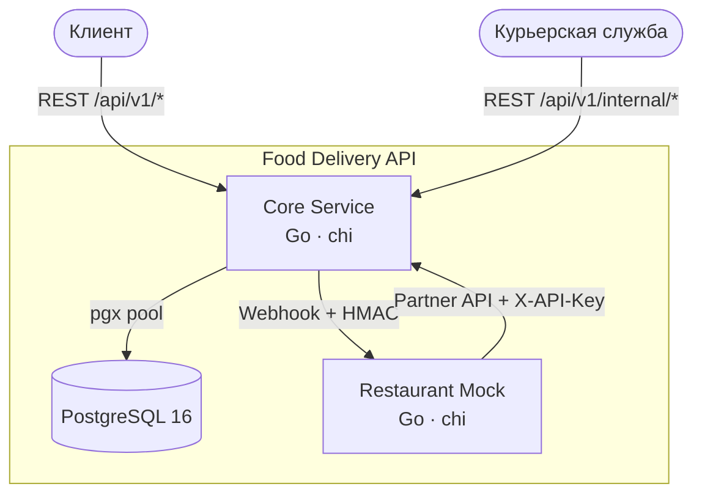
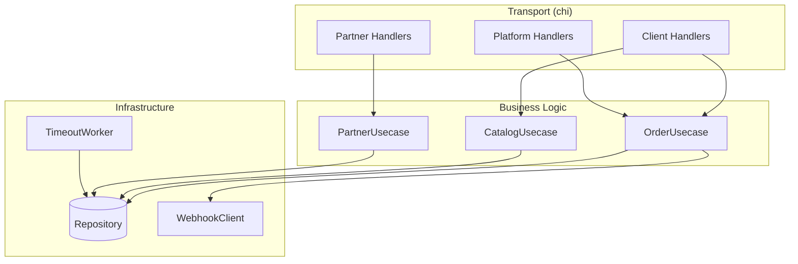
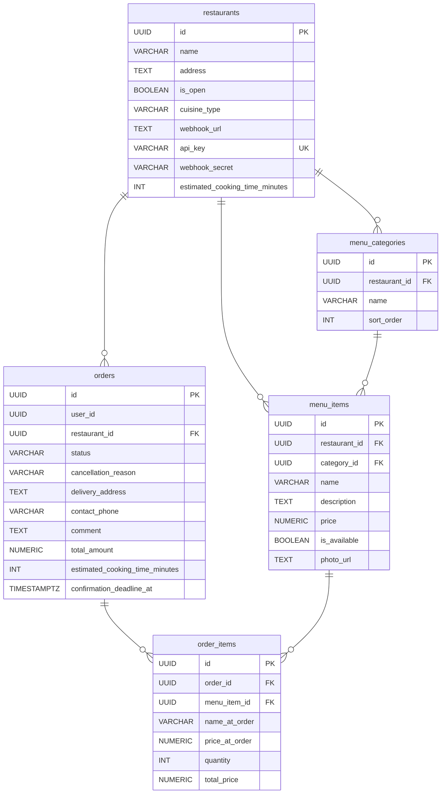
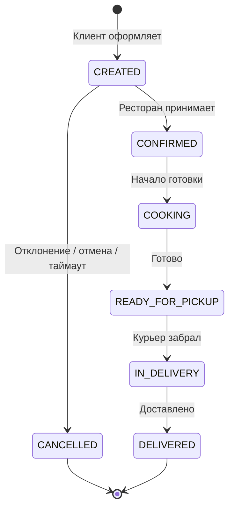

# Food Delivery API

**Food Delivery API** — бэкенд-сервис доставки еды на Go и PostgreSQL с клиентским API, партнёрским API для ресторанов и интеграцией через вебхуки.

Клиенты просматривают меню и оформляют заказы. Рестораны принимают заказы, обновляют статус приготовления и отмечают, когда заказ готов к выдаче.

## Как запустить проект

Для запуска нужны Docker и Docker Compose. Выполните команду из корня проекта:

```bash
docker compose up --build
```

**После запуска будут доступны:**
- Основной сервер API на порту `8080`.
- PostgreSQL на порту `5432`. При первом запуске в пустой базе создаются таблицы и добавляется ресторан «Додо & Ко» с пиццей и напитками.
- **Имитатор ресторана** на порту `8081`. Он получает вебхуки о новых заказах и обновляет статусы приготовления через партнёрский API.

Документация API и отправка запросов через Swagger UI: [http://localhost:8080/swagger/](http://localhost:8080/swagger/)

---

## Как это работает

После запуска можно посмотреть меню и оформить заказ из терминала.

**1. Выбор ресторана и просмотр меню:**
```bash
# Список ресторанов
curl http://localhost:8080/api/v1/restaurants

# Меню ресторана
curl http://localhost:8080/api/v1/restaurants/11111111-1111-1111-1111-111111111111/menu
```

**2. Оформление заказа:**
Сервис проверяет доступность блюд и сравнивает текущие цены с ценами в запросе. Если проверка пройдена, он сохраняет заказ и отправляет ресторану вебхук с HMAC-подписью.
```bash
curl -X POST http://localhost:8080/api/v1/orders \
  -H "Content-Type: application/json" \
  -H "X-User-ID: 00000000-0000-0000-0000-000000000001" \
  -d '{
    "restaurant_id": "11111111-1111-1111-1111-111111111111",
    "delivery_address": "ул. Мира, д. 1",
    "contact_phone": "+79991234567",
    "items": [
      {"item_id": "44444444-4444-4444-4444-444444444444", "quantity": 1, "expected_price": 590.00}
    ]
  }'
```

*В логах `docker compose` можно проследить, как имитатор ресторана проверяет подпись вебхука, принимает заказ и меняет его статус: CONFIRMED -> COOKING -> READY_FOR_PICKUP.*

---

## Сценарии клиента и ресторана (CJM)

Сценарии работы с диаграммами PlantUML и Mermaid:
* **[Путь клиента (CJM)](docs/diagrams/cjm_client.md)** — оформление заказа, недоступные блюда и отмена по таймауту.
* **[Путь ресторана (CJM)](docs/diagrams/cjm_restaurant.md)** — приём заказов, управление доступностью блюд и проверка подписи вебхука.

---

## Архитектура и схемы БД

<details>
<summary><b>Схемы сервисов, компонентов и базы данных</b></summary>

### Сервисы и их взаимодействие



### Компоненты основного сервиса



### Схема БД (ER-диаграмма)



Особенности хранения заказов:
- `order_items.price_at_order` — хранит цену на момент оформления заказа. Обновление меню не меняет стоимость старых заказов.
- `menu_item_id ON DELETE SET NULL` — при удалении блюда из меню история старых заказов сохраняется.
- Ограничения `CHECK` в базе требуют указать причину отмены заказа.

### Жизненный цикл заказа



</details>

---

## Упрощения текущей версии
Некоторые части сервиса упрощены для локального запуска:

| Упрощение | Описание |
|---|---|
| Аутентификация через заголовки (`X-User-ID`, `X-API-Key`) | Клиент передаёт ID в заголовке, ресторан — API-ключ. Полноценная аутентификация пользователей не реализована. |
| Один ресторан в базе при запуске | В начальных данных есть один ресторан с меню. Схема базы позволяет добавлять другие. |
| Миграции через `docker-entrypoint` | SQL-файлы выполняются при создании пустой базы. Для обновления существующей базы нужен отдельный механизм миграций. |
| Цены в `float64` | Денежные расчёты используют `float64`. Для точных расчётов стоит перейти на целые копейки или `decimal`. |

## Запуск тестов
Тесты, статический анализ и линтер запускаются из корня проекта:

Для тестов нужен Go 1.27, для проверки линтером — golangci-lint 2.14.0.

```bash
# Unit-тесты
go test -v ./...

# Встроенный статанализ Go
go vet ./...

# Линтер golangci-lint (настройки лежат в .golangci.yml)
golangci-lint run
```

---
