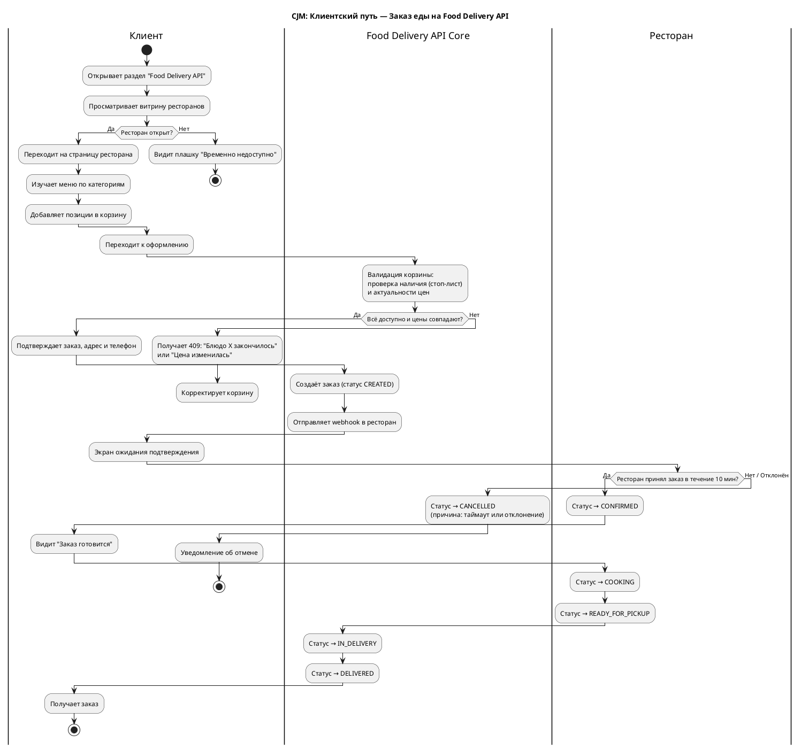
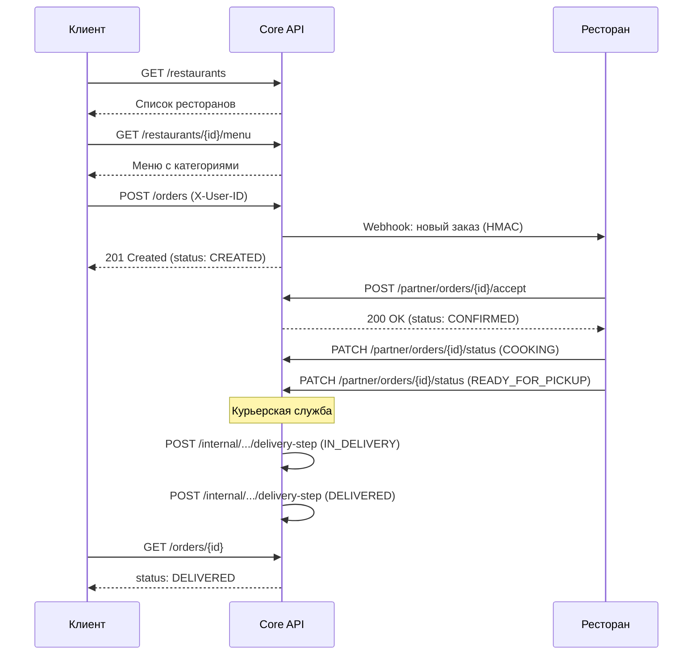
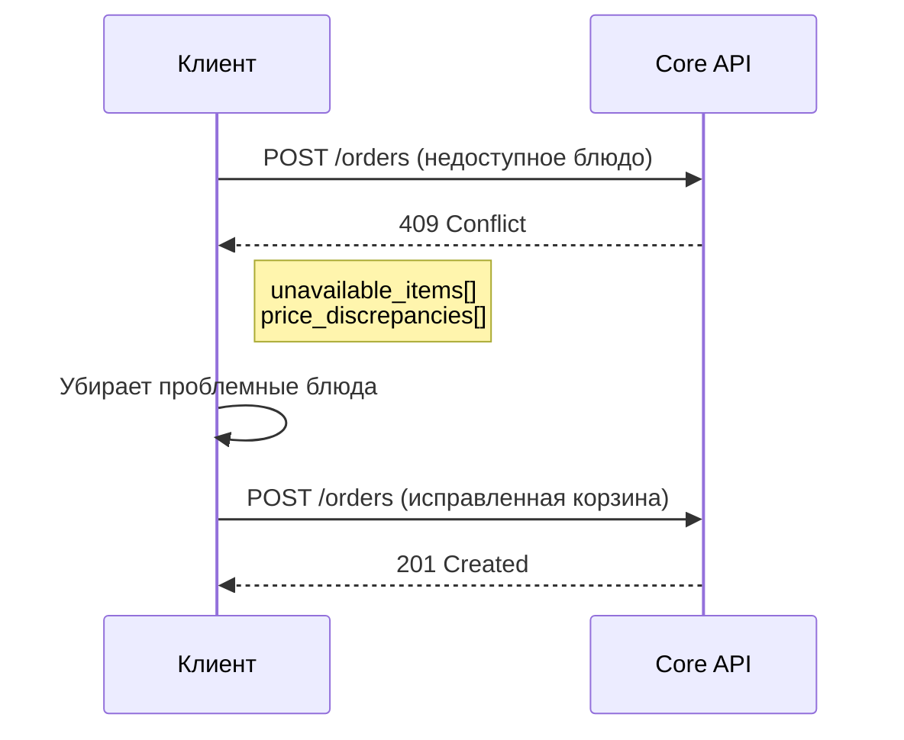
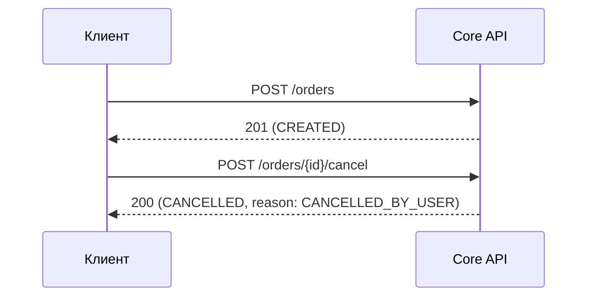
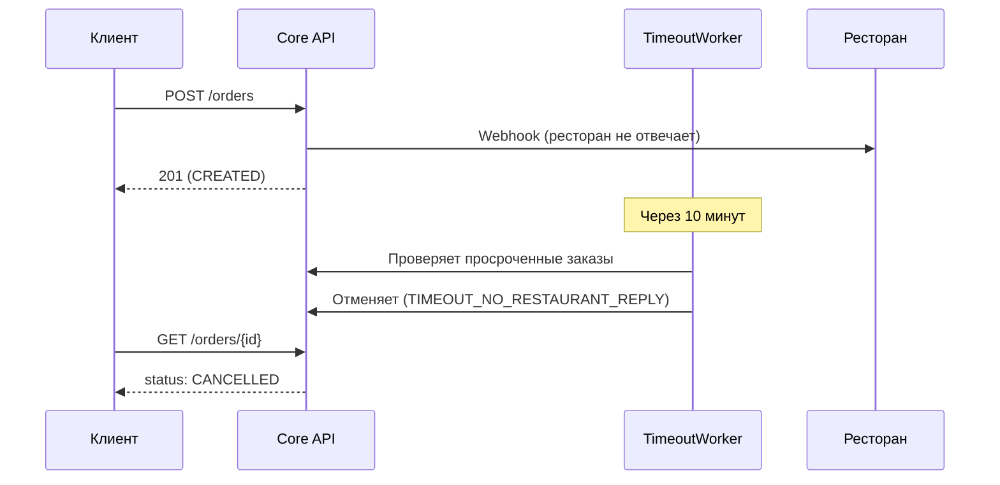

# CJM — Клиент (Пользователь Food Delivery API)

## Journey Map (PlantUML Activity Diagram)

---

## Сценарии (Sequence Diagrams)

### Успешный заказ

### Блюдо в стоп-листе (409 Conflict)

### Отмена клиентом

### Таймаут ресторана

