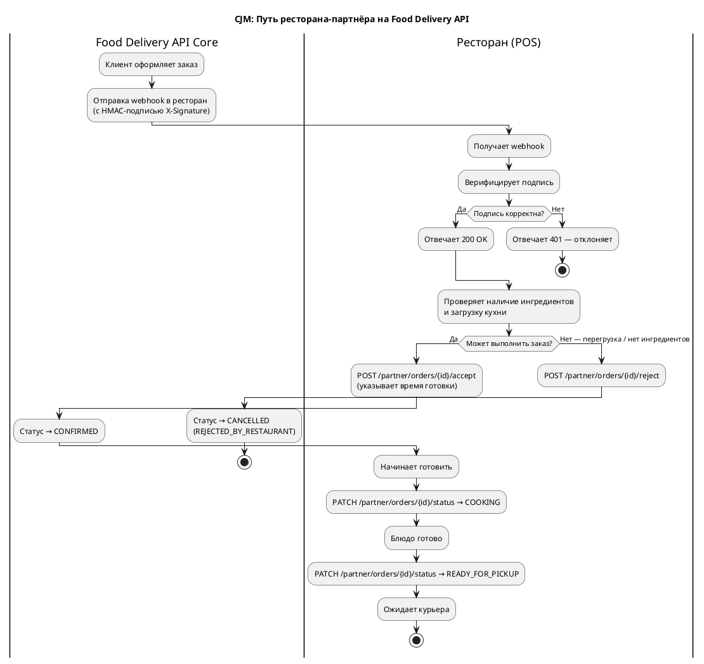
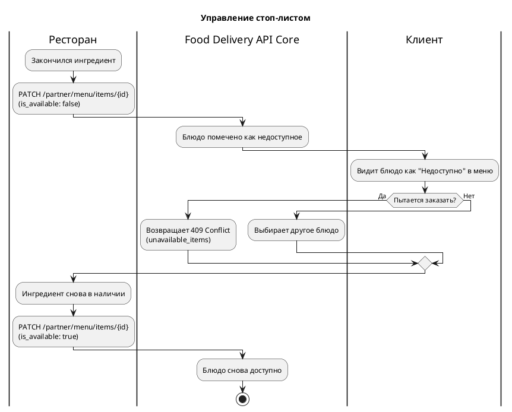
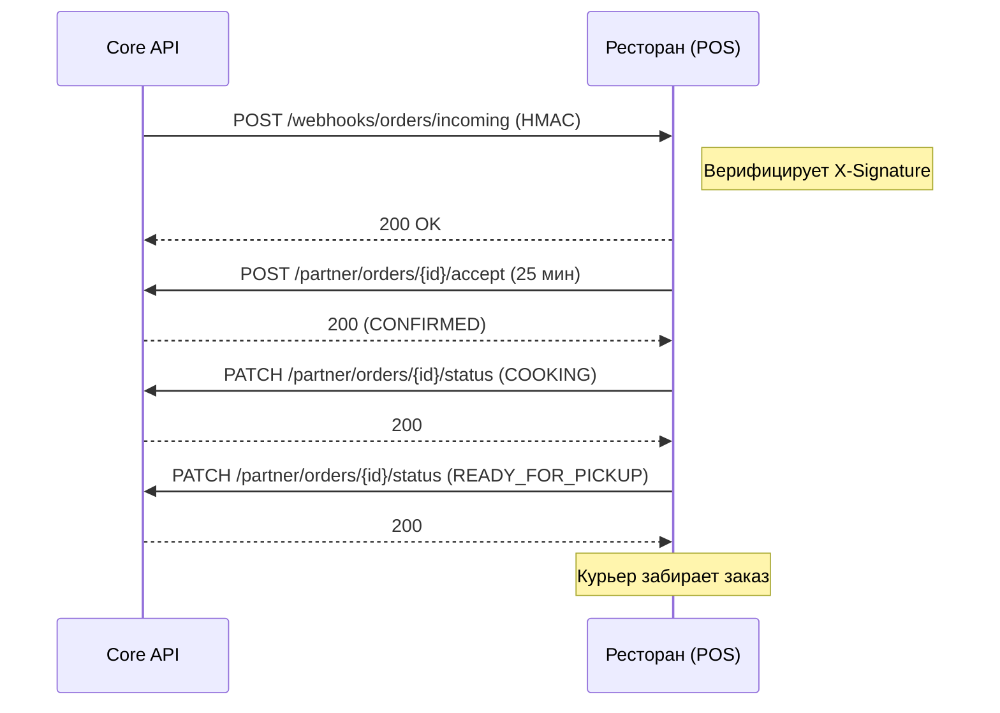
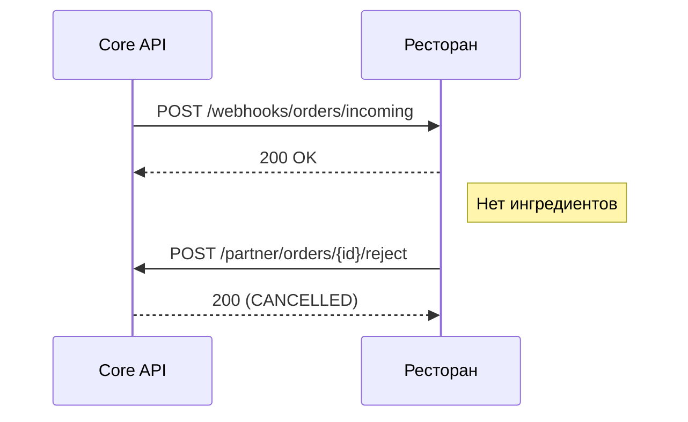
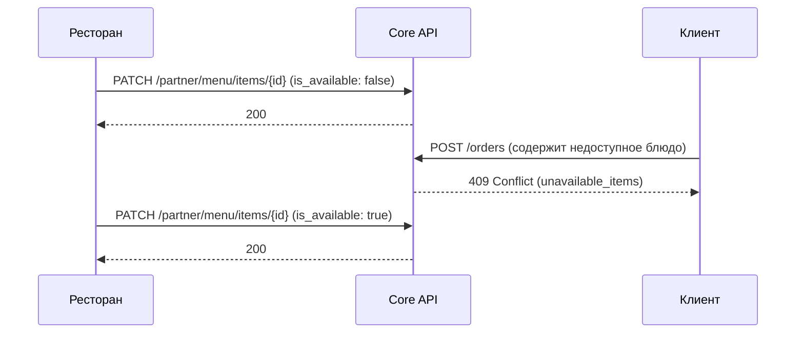
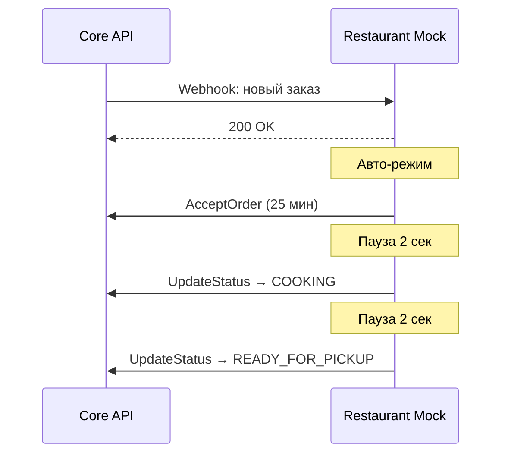

# CJM — Ресторан-партнёр (Food Delivery API)

## Journey Map (PlantUML Activity Diagram)

### Управление стоп-листом

---

## Сценарии (Sequence Diagrams)

### Приём и выполнение заказа

### Отклонение заказа

### Стоп-лист

### Автоматический pipeline (mock-ресторан)

При `RESTAURANT_AUTO_ACCEPT=true` мок-ресторан автоматически проводит заказ через весь цикл:

